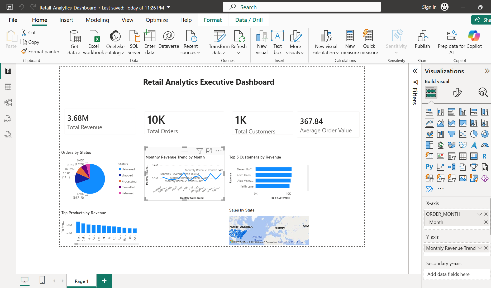

# Retail Analytics dbt Project

Staging and mart models for the retail analytics platform. See the top-level
`README.md` for the full pipeline; this project builds against Snowflake in
production or DuckDB locally/in CI (`dbt seed/run/test --profiles-dir ./ci_profiles`).

## 📊 Power BI Dashboard

The project includes an interactive Power BI dashboard that provides business insights from the transformed retail data.

### Dashboard Highlights
- Total Revenue
- Total Orders
- Total Customers
- Average Order Value
- Monthly Revenue Trend
- Order Status Distribution
- Top Products by Revenue
- Top Customers by Revenue
- Sales by State

### Dashboard Preview

